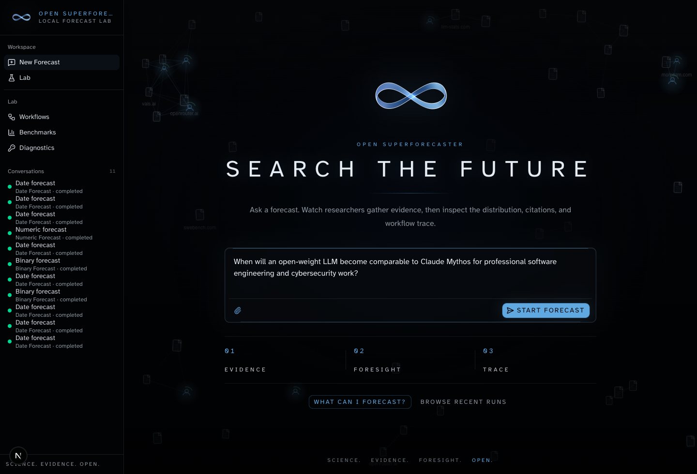
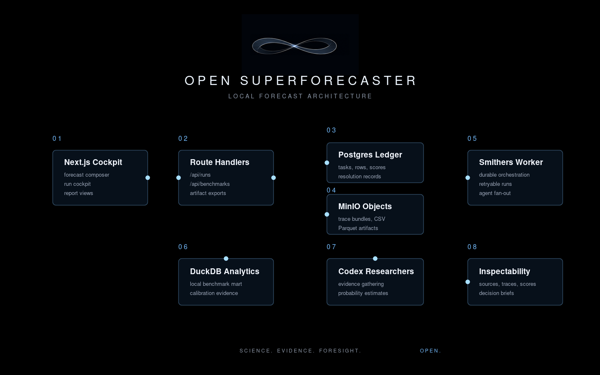

<p align="center">
  
</p>

# Open Superforecaster

Open Superforecaster is an open-source, self-runnable forecasting and research
appliance. It turns a question about the future into parallel agent research,
source-backed probability estimates, forecast artifacts, trace bundles, and
benchmark evidence that you can inspect locally.



## Why This Exists

AI forecasting is becoming a real product surface, not just a leaderboard
curiosity. Dynamic benchmarks such as
[ForecastBench](https://arxiv.org/abs/2409.19839) show both the promise and the
limits of current LLM forecasters. Newer scaffolded systems such as
[AIA Forecaster](https://arxiv.org/html/2511.07678v1) report results that are
competitive with expert superforecasters on some benchmarks, while liquid
prediction markets remain a hard baseline and ensembles can add value. The
space is moving quickly across pastcasting benchmarks, live tournaments, and
markets.

The point of this project is not to claim that this repo is already a
benchmark-grade oracle. The point is to keep the capability open, inspectable,
and runnable: a Docker Compose stack you can spin up on your own machine if you
have a Codex subscription, with Smithers orchestrating durable agent work under
the hood.

If you build on it or find a useful decision workflow, share it with
[ralf@boltshauser.com](mailto:ralf@boltshauser.com). I want to see where people
take open forecasting infrastructure.

## What You Can Do

- Ask binary, date, numeric, categorical, thresholded, and conditional forecast
  questions from the web UI.
- Fan out multiple CodexAgent researchers, then inspect their component
  forecasts, aggregate answer, rationale, and citations.
- Run local benchmark and pastcasting loops before trusting workflow changes;
  promotion review requires enough paired held-out cases and a comparison
  showing the candidate beat the baseline, not merely matched it.
- Export artifacts, trace bundles, CSV, Parquet, and local analytics tables for
  deeper review.
- Keep the full trust chain local: questions, sources, traces, scores,
  benchmark cases, and maintenance jobs are persisted as inspectable records.

## Architecture



Open Superforecaster uses a Next.js App Router UI for the local cockpit,
Postgres as the product ledger, MinIO-compatible object storage for artifacts
and trace bundles, DuckDB for local analytics, and Smithers to run durable
CodexAgent workflows.

## Trust Model

Forecasting systems fail when their assumptions, sources, or evaluation setup
are hidden. This project tries to make those parts boringly visible. Every
forecast should answer:

- What was the exact question and resolution criterion?
- What evidence did the agents use?
- How did individual researchers disagree?
- What probability or distribution was emitted?
- Which artifacts, traces, and benchmarks support the result?
- What should be re-run before using this in a real decision?

## Forecast Contract

Forecast requests can carry structured context in addition to the plain-language
question. Use these fields when available instead of burying them in prose:

- `resolutionCriteria` and `resolutionDate`
- `background`
- `marketPrice`, `marketPriceAsOf`, `marketCreationDate`, `marketPlatform`,
  and `marketUrl`
- `categories` and `categoriesExhaustive` for categorical forecasts
- `thresholds`, `thresholdDirection`, and `unit` for thresholded forecasts

Numeric and date forecasts emit p10, p25, p50, p75, and p90 distributions.
Categorical forecasts normalize probability mass over a frozen option set when
one is provided. Thresholded forecasts preserve explicit threshold order and
return a validation artifact instead of inventing generic thresholds when the
input is underspecified.

## Getting Started

### Prerequisites

- Docker Compose
- A Codex subscription, with local auth available under `${HOME}/.codex`
  or an auth profile under `./data/agent-auth/codex/default`
- Bun only if you want to run the web app directly on the host

### Start the Full Local Stack

```bash
cp .env.example .env
docker compose up --build
```

Open [http://localhost:3000](http://localhost:3000), ask a forecast, and inspect
the run from the sidebar. Open [http://localhost:3000/setup](http://localhost:3000/setup)
to inspect the active agent-provider policy and auth profile health.

The app binds to `127.0.0.1` by default because this local v1 does not include
user auth. To test from another machine on your LAN, set this in `.env` first:

```bash
OSF_WEB_BIND_ADDRESS=0.0.0.0
```

Then restart Compose and open `http://<host-lan-ip>:3000`. Do not expose it
publicly without adding authentication.

### Agent Providers and Auth

Workflows use Smithers agents through [`packages/workflows/src/agents.ts`](packages/workflows/src/agents.ts).
Codex is the default provider, but the same install can route structured,
research, forecast, and critic tasks to different Smithers-supported CLI agents.

Provider policy lives in `.env`:

```bash
AGENT_AUTH_ROOT=/agent-auth
AGENT_DEFAULT=codex:default
AGENT_STRUCTURED=codex:default
AGENT_RESEARCH=codex:default
AGENT_FORECAST=codex:default
AGENT_CRITIC=codex:default
AGENT_ALLOW_NATIVE_WEB=false
```

Each value is `provider:profile`. Docker mounts one auth root and keeps
provider-specific profiles underneath it:

```text
./data/agent-auth/
  codex/default/      # CODEX_HOME
  claude/default/     # CLAUDE_CONFIG_DIR
  kimi/default/       # KIMI_SHARE_DIR
  pi/default/         # PI sessions/config
```

Create an isolated Codex profile:

```bash
mkdir -p ./data/agent-auth/codex/default
CODEX_HOME="$PWD/data/agent-auth/codex/default" codex login
```

Or copy an existing Codex login:

```bash
mkdir -p ./data/agent-auth/codex/default
cp "$HOME/.codex/auth.json" ./data/agent-auth/codex/default/auth.json
chmod 600 ./data/agent-auth/codex/default/auth.json
```

Create an isolated Claude Code profile:

```bash
mkdir -p ./data/agent-auth/claude/default
CLAUDE_CONFIG_DIR="$PWD/data/agent-auth/claude/default" claude
```

Complete `/login` inside Claude Code, or copy an existing login:

```bash
mkdir -p ./data/agent-auth/claude/default
cp "$HOME/.claude/.credentials.json" ./data/agent-auth/claude/default/.credentials.json
chmod 600 ./data/agent-auth/claude/default/.credentials.json
```

Then add Claude to the policy when you want it used:

```bash
AGENT_RESEARCH=codex:default,claude:default
AGENT_CRITIC=claude:default,codex:default
CLAUDE_CONFIG_DIR=/agent-auth/claude/default
```

Keep `AGENT_ALLOW_NATIVE_WEB=false` unless you explicitly want provider-native
web search. Native web search is outside the deterministic source ledger and
should stay off for fixed-evidence and pastcasting evaluation.

See [`docs/agent-providers.md`](docs/agent-providers.md) for provider setup,
Docker mount details, and troubleshooting.

### Check Your Setup

After the stack is running, use the built-in onboarding check:

```bash
bun run onboarding:check
```

For a broader local smoke check:

```bash
bun run smoke:local
```

### Try Example Runs

Seed requests and CSVs live in [`examples/`](examples/). For example:

```bash
curl -X POST http://localhost:3000/api/runs \
  -H 'content-type: application/json' \
  -d @examples/request-binary-forecast.json
```

The create response includes durable links for automation. Use them to poll,
retrieve the normalized result, and materialize a decision-report artifact:

```bash
TASK_ID=<task-id-from-create-response>
curl http://localhost:3000/api/runs/$TASK_ID/status
curl http://localhost:3000/api/runs/$TASK_ID/result
curl -X POST http://localhost:3000/api/runs/$TASK_ID/report-artifact
```

Report artifacts persist a decision-oriented JSON object with the headline,
resolution context, answer, distribution, component agreement, uncertainty,
quality checks, aggregate review status, evidence summary, process trace,
links, and Markdown snapshot.

You can also plan sample workflows without launching agent work:

```bash
bun run workflow:samples
```

For scheduled or cron-style forecast operations, use the forecast ops runner.
It reads forecast requests, starts each run through the HTTP API, polls the
status endpoint, fetches the result, materializes a report artifact, and writes
a local manifest plus JSON/Markdown snapshots:

```bash
bun run forecast:ops
bun run forecast:ops -- --execute --case binary-foldable-iphone
bun run forecast:ops -- --batch-id july-smoke --execute --case binary-foldable-iphone
```

When outcomes are known, feed resolutions back into the scoring ledger:

```bash
bun run forecast:resolve -- --input examples/resolutions.sample.jsonl
bun run forecast:resolve -- --batch-id july-smoke --execute --input data/resolutions/manual.jsonl
```

Then snapshot the scored performance report:

```bash
bun run forecast:performance -- --batch-id july-smoke
```

The performance report includes grouped score means, best and worst resolved
aggregate forecasts, score trends, attention items, and binary aggregate
calibration buckets with expected calibration error. Calibration buckets with
enough resolved examples and large forecast-vs-observed gaps are added to the
attention queue with review actions and structured candidate calibration guard
rules for human review. Poor resolved binary aggregates that moved materially
away from their component base-rate anchor are also queued as baseline-sanity
misses for postmortem review. Poor resolved binary aggregates with material
resolution-boundary ambiguity are queued separately, so unclear criteria can be
treated as question-specification risk instead of hidden model error.
Poor resolved forecasts with narrow component probability ranges are also
surfaced as uncertainty-range misses, which helps separate calibrated confidence
from overconfident misses before changing prompts or guards.
Poor resolved binary forecasts with very high final probability distance from
50% are also bucketed and queued separately, so overconfident misses can be
reviewed before adding calibration rules.
Poor resolved forecasts where the aggregate downweighted or mixed component
weights are surfaced separately, so we can inspect whether the evaluator
discounted the component that best matched reality.
Poor resolved forecasts with high component disagreement are queued across
forecast types too: binary component probabilities, conditional branches,
threshold curves, numeric medians, date medians, and categorical top-choice
agreement all feed the same component-disagreement review path.
The metrics endpoint exports baseline-sanity score counts and means as
Prometheus series so large base-rate departures can be monitored outside the
lab dashboard.
Binary aggregates with structured market prices also persist a deterministic
`marketAnchor` audit with the market price, final probability, signed delta,
market platform, and divergence band. This is diagnostic, not an automatic
calibration rule: it lets resolved-score analytics separate useful
market-disagreement from avoidable drift before any default adjustment is
considered.

Binary forecast generation also applies a deterministic final calibration guard
for known threshold, timing, and production-ramp failure modes. The guard is an
explicit rule registry in `packages/workflows/src/binary-calibration-guard.ts`
so measured calibration rules can be reviewed, tested, and added outside the
workflow orchestration. Final binary aggregates include a structured
`calibrationGuard` block with applied rule ids and point adjustments plus a
deterministic `baselineSanity` audit comparing the final probability with the
mean component base-rate anchor and a `marketAnchor` audit for structured
market-price divergence. They also include a deterministic `resolutionBoundary`
audit summarizing component boundary reviews and ambiguity flags. Run reports
surface those guard rules, baseline deltas, market-anchor deltas, and
resolution-boundary status for review. They also persist an `uncertaintyRange`
audit over component probability ranges and a `componentWeighting` audit over
component audit weights. Future binary score rows persist
the same guard, baseline-sanity, market-anchor, resolution-boundary, uncertainty-range, component-weighting, aggregate-quality, aggregate-stat, and
selected plan-shape metadata in score config so performance snapshots can
compare guarded forecasts, large baseline movements, high component
market divergences, boundary ambiguity, narrow uncertainty ranges, component
downweighting, final-probability confidence, disagreement, aggregation anchors,
research depth, panel size, and complexity against outcomes, summarize score groups, and report guarded-vs-unguarded
Brier impact overall and by applied rule id. Worse overall or rule-level
guarded impact is also queued as a high-severity attention item
before more default guard rules are promoted.
Conditional score rows likewise preserve the resolved branch, condition
probability, branch probabilities, probability delta, condition-effect band,
resolved-branch placement, component branch disagreement, and effect-direction
agreement so performance reports can separate condition-probability errors,
lower-probability active branches, outcome-under-condition errors, and
high-disagreement conditional aggregates.
Thresholded score rows preserve threshold direction, source, count,
monotonicity repair status, curve spread and spread band, component curve
disagreement, resolved-value placement, and attempt count so flat, steep,
repaired, extracted, out-of-range, or internally split threshold curves can be
reviewed separately from clean caller-provided curves. Numeric and date score
rows preserve quantile interval width, unit, attempt count, median miss-distance
bands, numeric component-value disagreement, date never-probability bands,
resolved-position bands, and component median-date disagreement so wide,
out-of-interval, median-miss, split-component, split-timing, or unit-specific
forecasts can be compared against resolved errors. Categorical score rows
preserve top-choice confidence, normalized entropy, category source, closed-set
status, coverage band, category count, top-category component agreement, and
winner-probability spread plus resolved-category placement, so diffuse,
open-set, model-generated, missing-winner, or internally split option sets can
be reviewed separately. All forecast score rows also preserve evidence-coverage
metadata, including source count, source-domain count, dated/undated source
counts, source-diversity and concentration bands, top-domain share,
newest/oldest published source dates, evidence as-of date, newest-source age,
freshness band, post-as-of source count, timing band, uncertainty count,
rationale length, and method, so weakly sourced, single-domain,
source-concentrated, stale, future-dated, undated, or thinly explained
forecasts can be compared against resolved outcomes.
Forecast workflows share one timing reader so caller-provided
present/cutoff dates are shown in prompts and persisted as the evidence as-of
date across binary, date, numeric, categorical, thresholded, and conditional
aggregates. They also share canonical evidence aggregation with source-bank
persistence, so repeated citations are deduped before source-count analytics and
attempt-level key uncertainties are preserved on aggregate forecasts. New forecast runs also preserve
structured input context in score rows, including resolution criteria/date,
resolution horizon, market price and market-price recency, background,
option/threshold counts and bands, condition/unit flags, condition-criteria
coverage, and question length, so short-horizon, stale-market, market-anchored,
option-heavy, threshold-curve, condition-underspecified, or richly specified
questions can be measured separately from sparse prompts.
Score rows also keep workflow version,
workflow variant, experiment label, and run duration bands so quality changes
can be compared against runtime and variant changes.

To consolidate those local artifacts into one audit file:

```bash
bun run forecast:batches -- --batch-id july-smoke
```

Batch reports can merge local attention and candidate calibration guard review records from
`data/reports/forecast-attention-reviews.json` or a custom `--reviews-file`.
Use `bun run forecast:review` to update those local review records.
To pull open and deferred attention items plus candidate calibration guard
reviews across generated batch indexes:

```bash
bun run forecast:attention
bun run forecast:attention -- --batch-id july-smoke --status open
```

The attention backlog writes JSON and Markdown to
`data/reports/forecast-attention-backlog` and only reads the local
`batch-index.json` outputs.
For a one-screen health summary of the latest indexed batch:

```bash
bun run forecast:health
bun run forecast:health -- --batch-id july-smoke
```

The health report flags missing artifact phases, failed forecast or resolution
steps, unresolved attention items, open candidate calibration guard reviews, and
score-regression attention signals. Calibration guard regressions are called out
separately when guarded aggregates are scoring worse than unguarded aggregates;
baseline-sanity misses remain in the same unresolved attention lane as other
forecast postmortems. The latest local health report is also exposed through
`/api/diagnostics` and Prometheus batch-health series, so unresolved attention
can be monitored without opening the raw JSON artifact. `bun run duckdb:sync`
also exports the latest batch-health summary and issue rows into
`osf_forecast_batch_health` and `osf_forecast_batch_health_issues`.

Reviewed candidate calibration guard rules can be promoted through a local
evidence ladder:

```bash
bun run forecast:calibration-proposals
bun run forecast:calibration-validate
bun run forecast:calibration-validate -- --holdout-performance-report data/reports/forecast-performance/holdout/forecast-performance.json
bun run forecast:calibration-default-plan
```

The proposal step only drafts reviewed, ready candidate rules. Validation replays
the proposal against resolved binary aggregates and requires a held-out replay
before any row can become a default candidate. The default-plan step still does
not change runtime behavior; it writes the exact rule candidates, target file,
and manual acceptance criteria under
`data/reports/forecast-calibration-guard-default-plan`.

To check the local forecast script contracts:

```bash
bun run forecast:scripts:check
```

### Host Development

For direct host development, keep the backing services in Docker and run the web
app with Bun:

```bash
cp .env.host.example .env
docker compose up -d postgres redis minio minio-init otel-collector prometheus tempo grafana
bun install
bun run db:migrate
bun run dev
```

## More Detail

- Development history: [`DEVELOPMENT_LOG.md`](DEVELOPMENT_LOG.md)
- Example inputs: [`examples/`](examples/)
- Postgres container notes: [`docker/postgres/README.md`](docker/postgres/README.md)
