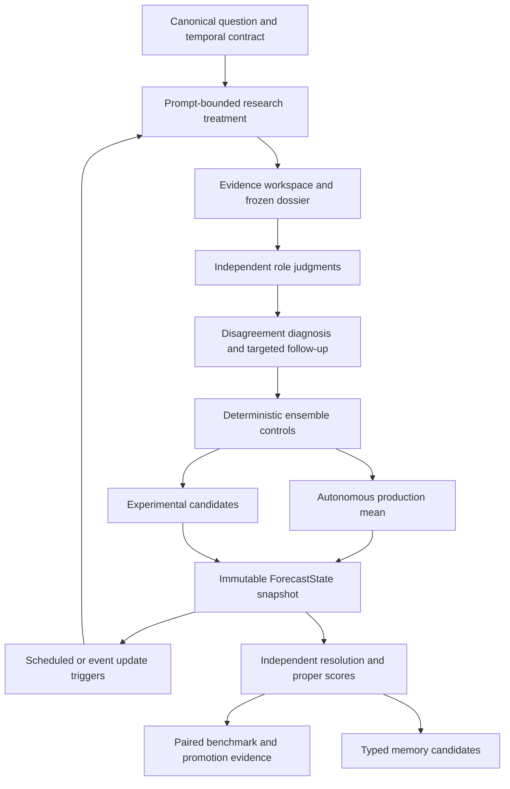

# Agentic Superforecasting: Implementation and Operations

Status: canonical implementation map and operational contract

Implementation snapshot: 2026-07-10

Read this document together with
[`agentic-superforecasting.md`](agentic-superforecasting.md). The research memo
explains why the architecture exists; this document records what the repository
actually does, where it lives, how to operate it, and which claims are not yet
earned.

The system is designed to become a strong forecaster through measured iteration.
It is not called a superforecaster merely because it has many agents or a polished
rationale. The production binary output remains a transparent control until a
candidate wins a sufficiently large, paired, chronological evaluation.

## Non-Negotiable Invariants

1. The forecast target is the exact resolution contract at a named information
   boundary, not a vague question about the future.
2. An output is eligible for autonomous scoring only when its structured
   isolation status is explicitly `isolated`. Structured market fields stay
   outside the autonomous prompt; explicit human forecasts in background or
   fixed packets are deterministically redacted before every autonomous stage.
   Component, source, prior-state, temporal, and exact-provider activity audits
   fail closed rather than treating a missing status as clean.
3. Every selected component judgment must be persisted. Observed provider and
   model identity must be retained when Smithers exposes it; any compatibility
   fallback must remain explicitly labelled as configured, not observed.
4. The unweighted arithmetic mean and median are immutable controls. The mean is
   the current production binary selection.
5. An LLM synthesizer, logit pool, prior shrinkage, topical adjustment, market
   blend, or calibrator is a candidate until it wins out-of-time evaluation.
6. A source, query, or page may be called harness-observed only if the environment
   intercepted it. Model-reported research stays explicitly agent-reported.
7. Public backtests are development evidence. They are not a private holdout or
   a prospective capability claim.
8. Repeated snapshots and related questions are clustered by underlying event
   for statistical inference; they are not independent samples.
9. Question-local memory is typed state, not a transcript. V1 caps active
   factors at 64, unresolved information needs at 32, and trigger conditions at
   32. Cross-question memory cannot
   become active without resolved sources and later holdout validation.

## End-to-End Binary Path



The model is responsible for deciding what is worth investigating and how the
evidence changes its judgment. Deterministic code owns the schema, timing,
aggregation controls, state identity, persistence, resolution scoring, and
promotion thresholds. It configures research budgets and validates the shape of
agent-reported usage counters, but it cannot enforce provider tool-call budgets
until research tools are intercepted by the harness.

## What Is Implemented

### 1. Canonical question and time state

Forecast inputs carry separate canonical fields:

- `forecastAsOf`: when the probability was made;
- `evidenceAsOf`: the newest evidence the run claims to include;
- `cutoffDate`: the hard latest permissible information time;
- `resolutionCriteria`, `resolutionDate`, `condition`, and `background`.

Offset-less datetimes are rejected. Missing timing becomes an explicit partial
trust state; a cutoff is never silently substituted for evidence recency.
Ordinary runs, benchmark inputs, artifacts, snapshots, and traces retain these
fields.

Primary code:

- [`packages/workflow-contracts/src/index.ts`](../packages/workflow-contracts/src/index.ts)
- [`packages/workflows/src/forecast-timing.ts`](../packages/workflows/src/forecast-timing.ts)
- [`packages/backend/src/forecast-input-context-metadata.ts`](../packages/backend/src/forecast-input-context-metadata.ts)

### 2. Four research treatments

The binary workflow accepts one of four named treatments:

| Value | Experimental condition |
| --- | --- |
| `no_external_research` | Judges are told to use no external search. |
| `shared_frozen_dossier` | All judges receive the same frozen dossier and are told not to search further. |
| `independent_research` | Each judge is instructed to pursue its own prompt-bounded research path. |
| `shared_plus_followup` | Judges begin with a shared dossier and are instructed to run only a small number of targeted follow-ups. This is the current default. |

The shared dossier records queries, sources, atomic claims, stance,
diagnosticity, dependence groups, claim checks, open questions, cutoff status,
and remaining uncertainty. The evidence workspace deduplicates reported claims
and sources and distinguishes `agent_reported` from `harness_observed`
provenance.

Per-judge treatment budgets remain configuration and prompt contracts. The
dossier schema rejects a reported query history or `searchesUsed` count that
exceeds its declared budget or disagrees with the recorded history. Exact Codex
activity telemetry independently flags a shared-dossier query count above that
budget. This still does not intercept or stop a provider tool call before the
model sees its result.

Before a dossier reaches a judge, deterministic code removes sources dated
after the hard cutoff and sources containing explicit human/market forecasts.
It discards the model's free-form summary, checks, and open questions, then
rebuilds the judgment view only from retained atomic claims. The raw dossier and
a structured quarantine audit remain in the final artifact. A contaminated
dossier cannot invalidate claims from a previous snapshot.

Important limitation: Codex search currently occurs inside the Smithers agent
process. The application does not yet intercept each tool call or archive each
page before the model sees it. Consequently, ordinary research dossiers and
their query histories are marked `agent_reported`. Prompt restrictions are not
treated as proof of causal information isolation.

The application now records a narrower `provider_observed_activity` trace for
Codex search/open/find requests. It resolves the rollout by the exact provider
thread ID, verifies that ID inside `session_meta`, and limits activity to the
Smithers attempt's inclusive start/finish window. The audit enumerates planner,
dossier, every judgment iteration/retry, candidate aggregate, and quality review
executions. Malformed rollouts, missing metadata, unsupported provider adapters,
forbidden activity, explicit human-forecast activity, and observed shared-dossier
budget overruns become fail-closed isolation flags. Each trace retains the
provider timestamp, sets `contentObserved = false`, and never becomes source-bank
evidence. Smithers 0.27's timestamp-and-working-directory session backfill is
not trusted for provenance: a repository audit reproduced a case where it
attached unrelated web searches from another Codex task.

Primary code:

- [`packages/workflows/src/forecast-research-dossier.ts`](../packages/workflows/src/forecast-research-dossier.ts)
- [`packages/workflows/src/forecast-evidence-workspace.ts`](../packages/workflows/src/forecast-evidence-workspace.ts)
- [`packages/workflows/src/binary-forecast.workflow.tsx`](../packages/workflows/src/binary-forecast.workflow.tsx)
- [`packages/backend/src/smithers-research-activity.ts`](../packages/backend/src/smithers-research-activity.ts)

### 3. Judgment, disagreement, and independence

The planner selects a bounded panel from explicit roles. Every selected output
is persisted, including dynamically selected roles beyond the original three.
When Smithers attempt metadata is complete, execution attribution and the exact
provider thread ID come from that observed metadata rather than the current
configuration. Older or partial runs fall back to the configured policy and are
explicitly marked `configured_policy_fallback` or
`smithers_attempt_metadata_partial`; a null thread/model must not be presented
as observed execution identity. Only complete observed attributions contribute
provider IDs to ForecastState independence diagnostics; telemetry gaps make the
autonomous state ineligible for isolated scoring.

The disagreement controller identifies disputed facts, base rates, resolution
ambiguity, correlated evidence, and missing information. It can request bounded
follow-up research, but it cannot directly assign or override the production
probability. Independence diagnostics expose evidence overlap, source overlap,
distinct roles, distinct providers, and an explicitly non-weighting effective
size proxy.

Primary code:

- [`packages/workflows/src/forecast-disagreement.ts`](../packages/workflows/src/forecast-disagreement.ts)
- [`packages/workflows/src/forecast-independence.ts`](../packages/workflows/src/forecast-independence.ts)
- [`packages/backend/src/run-service.ts`](../packages/backend/src/run-service.ts)

### 4. Deterministic aggregation and information isolation

Every binary state contains:

- arithmetic mean, median, logit mean, optional trimmed mean, range, and standard
  deviation;
- autonomous production output: `unweighted_arithmetic_mean_v1`;
- experimental logit-pool and prior-shrinkage candidates;
- the constrained LLM aggregate as an experimental candidate;
- an optional, separately labelled market-assisted linear pool;
- explicit human-forecast exposure flags.

Market metadata is removed from the autonomous structured prompt, the
`market-consensus` role is excluded, and autonomous prompts forbid prediction
market, bookmaker, analyst-probability, and crowd-probability sources. A supplied
market price is combined only after the autonomous output is frozen. Explicit
human forecasts in background and fixed evidence are redacted before planning,
research, judgment, aggregation, and review; the raw input and redaction audit
remain inspectable. Updates receive an autonomous-only prior projection, never
the prior assisted/market output, free-form update reason, or unresolved-memory
text. Human-forecast and temporal citation violations are accumulated across
every review round. Post-cutoff and post-`evidenceAsOf` citations, non-isolated
prior state, provider-policy violations, and incomplete provider audits all make
the autonomous track ineligible for benchmark, product, and trajectory scores.
Explicit declarations of non-use (including comma-separated lists such as
“used no prediction markets, crowd forecasts, or bookmaker odds”) are treated
as audit statements rather than exposure; an affirmative forecast value or
source mention in the same contrastive clause remains fail-closed.
Because opaque agent content still cannot be intercepted before consumption,
`isolated` means no implemented audit found a violation, not proof of perfect
causal isolation.

The old topical regex adjustment is disabled by default. It is available only
as the named `topical_regex_experimental_v1` candidate and is never selected as
a fitted calibrator.

The repository can now fit an inactive global Platt-calibration candidate over
the logit of the raw autonomous probability. The deterministic fitter uses L2
regularization, chronological train/validation separation, label-availability
embargoes, event-family separation and equal family weighting. A candidate must
improve held-out Brier and log loss with both paired 95% intervals below zero.
Even then it is persisted with `active = false`; there is deliberately no
automatic activation path. Raw mean and median remain preserved and the
crowd-assisted track is excluded from fitting.

Primary code:

- [`packages/workflows/src/forecast-aggregation.ts`](../packages/workflows/src/forecast-aggregation.ts)
- [`packages/workflows/src/forecast-state.ts`](../packages/workflows/src/forecast-state.ts)
- [`packages/workflows/src/binary-calibration-guard.ts`](../packages/workflows/src/binary-calibration-guard.ts)
- [`packages/evals/src/binary-calibration.ts`](../packages/evals/src/binary-calibration.ts)
- [`packages/backend/src/binary-calibration-candidate-service.ts`](../packages/backend/src/binary-calibration-candidate-service.ts)

### 5. Immutable ForecastState and live lifecycle

`ForecastState v1` contains the question, temporal trust state, evidence graph,
component judgments, aggregation controls, autonomous and assisted outputs,
update delta, active factors, unresolved information needs, and exact workflow
versions. Identical inputs produce the same state ID.

Postgres now distinguishes the unresolved object from execution runs:

| Table | Purpose |
| --- | --- |
| `forecast_questions` | One canonical unresolved question across many runs. |
| `forecast_snapshots` | Immutable ForecastState snapshots and queryable headline probabilities. |
| `forecast_update_triggers` | Scheduled reviews and dormant signpost triggers. |
| `forecast_memory_entries` | Versioned question-local or cross-question memory. |

A new snapshot links to the previous one, calculates its probability delta,
records new and invalidated claims, retires prior active triggers, advances the
question pointer, and replaces active question-local memory. Snapshot commit
rejects resolved, annulled, or archived questions. Resolution locks the same
canonical row and transactionally inserts/reuses the resolution, closes the
question, clears update leases, retires active and snoozed triggers, deprecates
local memory, and writes eligible scores.
Prior evidence is merged into the new workspace; omission by a later model is
not deletion. Only a stable claim ID listed in
`invalidatedEvidenceClaimIds` removes a prior claim.

Binary and non-binary ledger projection is exact-once and transaction-scoped.
For both paths, the task row is locked and attempts, aggregate, sources,
citations, and ledger trace events are written in one Postgres transaction. The
binary path additionally writes its ForecastState snapshot, canonical question
pointer, triggers, and local memory in that transaction. A versioned commit
manifest is written last. It records the input digest, Smithers run ID, artifact
and artifact-row IDs, forecast type, aggregate ID, optional snapshot/state IDs,
and the component-attempt, source, and citation ID lists. It does not enumerate
question, trigger, memory, or trace-event IDs. Concurrent reconciliation returns
the same manifest. An unmarked legacy attempt row is treated as an unsafe
partial ledger requiring repair, never as proof of completion. The artifact row
before this transaction and the final task-status transition after it are
independently idempotent and recoverable.

Product binary forecasts require a ForecastState snapshot. Stateless binary
fixed-evidence and pastcasting evaluation workflows commit exact attempt and
aggregate ledgers with null snapshot/state IDs rather than fabricating state.
Run detail, trace export, manual resolution, trajectory scoring, and benchmark
score backfill consume only supported committed manifests; unmarked legacy rows
are excluded or moved to `needs_review`. A committed manifest recovers a stale
`running` task directly to `completed`, while all terminal task transitions use
compare-and-set predicates.

The deterministic cadence reviews far-away questions every 30 days and moves to
7-day and 1-day intervals near the boundary. Date-only boundaries are treated as
end-of-day. The runner is dry-run by default:

```bash
bun run forecast:update-due
bun run forecast:update-due -- --execute
```

Signpost triggers are persisted with `next_check_at = null`; a future event-source
adapter must observe a real change and make or launch the event-triggered update.
The current runner automatically executes scheduled reviews only.

Execute mode first acquires an atomic question-level lease using row locks and
`SKIP LOCKED`. This prevents sibling triggers or concurrent runners from
launching two updates for one question. Leases are owner-checked, recover after
expiry or asynchronous failure, and are cleared by a successful successor
snapshot. Snapshot succession also requires the named prior state to remain the
latest and a strictly later `forecastAsOf`.

Primary code:

- [`packages/backend/src/forecast-state-service.ts`](../packages/backend/src/forecast-state-service.ts)
- [`packages/workflow-contracts/src/forecast-update-policy.ts`](../packages/workflow-contracts/src/forecast-update-policy.ts)
- [`scripts/forecast-update-runner.ts`](../scripts/forecast-update-runner.ts)
- [`packages/db/src/schema.ts`](../packages/db/src/schema.ts)

### 6. Resolution and scoring

Binary forecasts receive Brier and log scores. Categorical, thresholded, and
conditional forecasts retain type-appropriate scoring. Numeric and date
quantiles now receive pinball losses, interval coverage and sharpness, proper
interval scores, and a weighted-interval-score approximation to CRPS. Crossed
or duplicate quantiles become explicit coherence failures instead of being
silently sorted into valid distributions.

When a canonical binary question resolves, every immutable snapshot in its
trajectory receives separate autonomous Brier and log-loss rows. These retain
update kind, probability delta, state lineage, lead time, temporal trust, and
workflow versions. Missing, inconsistent, or post-resolution timing remains
visible but is ineligible for update-policy evaluation.

Primary code:

- [`packages/evals/src/index.ts`](../packages/evals/src/index.ts)
- [`packages/evals/src/distribution.ts`](../packages/evals/src/distribution.ts)
- [`packages/backend/src/resolution-service.ts`](../packages/backend/src/resolution-service.ts)

### 7. Benchmarking and promotion

The evaluation ladder distinguishes contract checks, component tests, public
development data, a future private lockbox, and prospective cohorts. BTF-2 is
tagged `public_development` even when its upstream dataset row came from a split
named `test`.

Binary benchmark results can score autonomous, crowd-assisted, and frozen market
tracks separately. Comparisons retain paired deltas and use event-family
clustered bootstrap intervals when family metadata is sufficiently complete.
Actual default promotion requires at least 500 paired cases, 250 paired holdout
cases, 200 explicit event families, and 95% family metadata coverage. The
10-case path remains an infrastructure smoke gate and cannot promote a runtime
default.

Distribution metrics, source cutoff audit, provenance coverage, trace health,
schema validity, cost, and leakage remain visible beside the primary score.

Primary code:

- [`packages/backend/src/benchmark-promotion-policy.ts`](../packages/backend/src/benchmark-promotion-policy.ts)
- [`packages/backend/src/benchmark-statistics.ts`](../packages/backend/src/benchmark-statistics.ts)
- [`packages/backend/src/benchmark-service.ts`](../packages/backend/src/benchmark-service.ts)
- [`packages/backend/src/btf2-importer.ts`](../packages/backend/src/btf2-importer.ts)

## Database and Analytics Upgrade

Apply migrations before running the stateful workflow on an existing database:

```bash
bun run db:migrate
```

Migrations `0008` through `0014` add canonical questions, snapshots, update
triggers, typed memory, source-provenance fields, question background,
scheduler version, trajectory scores, recoverable update leases, and durable
forecast-ledger commit manifests. Rebuild local analytics after forecasts or resolutions:

```bash
bun run duckdb:sync
```

The DuckDB mart includes snapshot, trigger, memory, richer source, ledger-commit,
and benchmark track data. Trace bundles use schema version 4. For committed
forecasts they load the exact manifest attempts, aggregate, snapshot, sources,
and citations; question, trigger, and memory rows are projected at that
snapshot's commit boundary so a later update cannot create dangling references
inside an earlier task's bundle.
Trajectory scores are available in `osf_forecast_trajectory_scores`.

## How to Benchmark a Change

1. Name one change and freeze its workflow/model/tool configuration.
2. Predeclare the primary paired metric, minimally useful effect, source and
   latency budgets, and catastrophic-error policy.
3. Run contract and component tests first.
4. Develop on public frozen data such as BTF, explicitly labelled as public
   development.
5. Compare against the incumbent unweighted mean on the same questions,
   timestamps, evidence condition, and budget.
6. Separate event families and calendar periods. Prefer clustered inference.
7. Promote only after a later private chronological holdout, then confirm on a
   prospective unresolved cohort.
8. Keep losing candidates and their reports. Negative results prevent repeated
   rediscovery of the same idea.

The first useful experiments are the named research treatments, 1/3/5 component
runs, persona versus provider/search-path diversity, agentic aggregate versus
mean, no calibration versus chronological Platt calibration, autonomous versus
assisted, and one-shot versus scheduled updating.

## Current Capability Boundary

Implemented infrastructure is not the same as demonstrated forecasting skill.
The following remain deliberately incomplete:

- harness-level pre-consumption interception, immutable page archives, content
  hashes/spans, and proof of what page text the model actually received;
- harness-enforced per-judge research/follow-up call budgets and retention caps
  for the accumulated evidence graph (local memory and trigger arrays are
  bounded, but evidence history can still grow across updates);
- source adapters that detect signpost changes and fire event triggers;
- an automated repair tool for pre-0014 unmarked legacy ledgers (they are
  quarantined rather than guessed complete);
- private uncontaminated lockbox data and a long prospective track record;
- enough resolved chronological data to activate a statistical calibrator;
- empirically fitted aggregation, market-blend, or update-policy parameters;
- structured statistical baseline tools for arbitrary economic and time-series
  questions;
- validated global lessons learned across many later resolved questions;
- cost-aware search-policy training or outcome-based reinforcement learning.

Until those exist, the honest product claim is: an inspectable, stateful,
benchmarkable agentic forecasting harness with conservative deterministic
defaults—not a proven superhuman forecaster.

## Validation Contract

Before merging changes to forecasting behavior, run:

```bash
bun run typecheck
bun test
bun run forecast:scripts:check
bun run --cwd apps/web lint
bun run build
git diff --check
```

Tests of a candidate method must preserve raw mean and median values, timing and
source provenance, autonomous/assisted separation, and chronological split
metadata.

## Recovery Checklist for a Future Agent

When conversation context is gone:

1. Read root [`AGENTS.md`](../AGENTS.md).
2. Read the research memo and this implementation guide completely.
3. Inspect the current code before assuming the dated documents are exact.
4. Run `git status --short`; preserve unrelated work.
5. Run the validation contract before and after a forecasting change.
6. Inspect `ForecastState` first when tracing a binary output; it is the central
   reconstruction object.
7. Inspect the task's `forecastLedgerManifest` when checking exact-once
   projection; its attempt, aggregate, snapshot, source, and citation IDs are
   the committed read set.
8. Treat `provider_observed_activity` as action telemetry, never as observed
   evidence content or a cutoff-safe source.
9. Treat `DEVELOPMENT_LOG.md` as history, not as the architecture contract.

## Revision Log

- 2026-07-10: Adversarial integrity pass added atomic resolution/question
  closure, fail-closed manifest-only scoring, closed-question snapshot guards,
  CAS terminal reconciliation, schema-v4 point-in-time trace bundles,
  autonomous input redaction and prior-state projection, all-round temporal and
  human-source audits, exact attempt-window provider telemetry, provider-policy
  scoring gates, reported/shared research budget checks, hard local-memory
  cardinality limits, and regression coverage for explicit non-use declarations.
- 2026-07-10: Live-agent canaries added exact Codex reasoning-effort pinning,
  resolved host-auth health checks, JSON-string ForecastState decoding,
  transactional ledger manifests, cancelled-run reconciliation, exact-thread
  provider activity traces, and structured autonomous-exposure classification.
- 2026-07-10: Implemented the first stateful agentic-superforecasting core:
  temporal contract, research treatments, evidence workspace, full attempt
  persistence, deterministic controls, autonomous/assisted separation,
  ForecastState snapshots, live scheduling, bounded memory, distributional
  scoring, clustered benchmark inference, and statistical promotion tiers.
