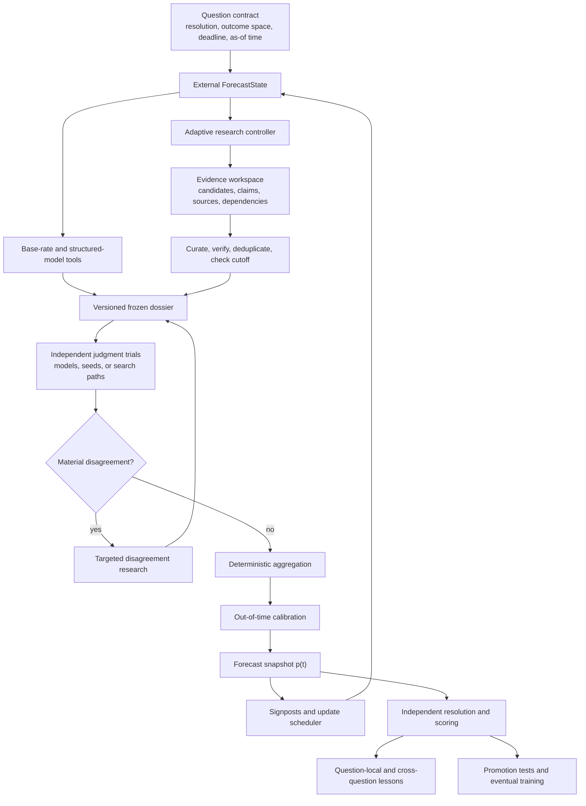

# Agentic Superforecasting: Research, Architecture, and Roadmap

Status: canonical research and design memo. For current implemented behavior,
read [`agentic-superforecasting-implementation.md`](agentic-superforecasting-implementation.md).

Research snapshot: 2026-07-15

Search terms: Harness-1, FutureSearch, AIA Forecaster, Bayesian Linguistic
Forecaster, BLF, Milkyway, ForecastCompass, Foresight Learning, ForecastBench,
FutureEval, BTF, superforecasting, evidence harness, belief state, calibration.

This document preserves the evidence and design decisions behind the next phase
of Open Superforecaster. Read it before changing forecasting architecture,
research provenance, aggregation, calibration, live updating, benchmark design,
or promotion policy.

The central conclusion is:

> An agentic superforecaster should be a modular forecasting system with explicit
> state and independently testable research, judgment, aggregation, calibration,
> updating, resolution, and learning stages. It should not be one elaborate
> prompt or an unobserved collection of agents.

## How to Interpret the Evidence

Forecasting research has unusually serious evaluation hazards. This memo uses
the following evidence hierarchy:

1. Prospective forecasts on genuinely unresolved events, frozen before outcomes.
2. Private, time-separated pastcasts with immutable sources and hidden labels.
3. Public pastcasts with frozen sources, after checking model-cutoff contamination.
4. Controlled component ablations such as retrieval or fixed-evidence judgment.
5. Vendor-run benchmarks, preliminary leaderboards, and case studies.

Component success does not imply end-to-end forecasting skill. Retrieval recall
is not Brier score. Calibration without refinement can be achieved by predicting
base rates. Trading profit confounds probability quality with timing, sizing,
liquidity, execution, and risk. Human-parity claims require the same questions,
timestamps, information, and resource budgets.

Most 2026 systems discussed here are preprints, workshop papers, technical
reports, or commercial systems. Their architectural ideas are more reliable than
their broadest performance claims.

## First-Principles Definition

For a binary question, the operational target is:

```text
P(outcome resolves YES | exact resolution contract, information available at time t)
```

That definition implies four invariants:

1. The event and its resolution boundary must be exact.
2. The information state must be causally bounded to the forecast-as-of time.
3. The output must be a probability evaluated by a proper scoring rule.
4. Every update must be attributable to new evidence, changed interpretation, or
   an explicit model/calibration change.

An accurate forecast is not yet a good decision. Decisions also require payoffs,
causal effects, action costs, asymmetric harm, and robustness to model failure.
The forecasting layer should therefore remain separate from downstream decision
or trading policies.

## Human Superforecasting: What Is Established

The human literature supports a system, not a class of oracles.

- Brier's 1950 paper established the probability scoring rule used by modern
  tournaments: [Verification of Forecasts Expressed in Terms of
  Probability](https://journals.ametsoc.org/view/journals/mwre/78/1/1520-0493_1950_078_0001_vofeit_2_0_co_2.xml).
- Mechanical combination often matches or beats unaided professional judgment;
  see Meehl's *Clinical Versus Statistical Prediction* and the later
  [Dawes, Faust, and Meehl review](https://pubmed.ncbi.nlm.nih.gov/2648573/).
- Tetlock's long-running expert study showed that performance varies by horizon,
  question, cognitive style, and accountability. The "dart-throwing chimp"
  summary is a caricature. The deeper account is [*Expert Political
  Judgment*](https://www.degruyter.com/document/doi/10.1515/9781400888818/html).
- IARPA's ACE program and the Good Judgment Project showed that probability
  training, teams, tracking, and aggregation can improve near-term geopolitical
  forecasting. Core papers include [Mellers et al.
  2014](https://pubmed.ncbi.nlm.nih.gov/24659192/) and [Mellers et al.
  2015](https://journals.sagepub.com/doi/10.1177/1745691615577794).

Important limits:

- Participants were selected, highly educated volunteers performing demanding
  tournament work, not a representative public sample.
- "Superforecaster" was initially an ex-post top-performer label. Persistence in
  later years argues against pure luck, but stable ability is intertwined with
  motivation, practice, feedback, team quality, and effort.
- Question selection and update timing are part skill and part evaluation
  confound. A 2025 reanalysis found that controlling them substantially changes
  estimates of training and team effects: [Hauenstein et
  al.](https://journals.sagepub.com/doi/10.1177/09567976241266481).
- The strongest evidence concerns clear, resolvable questions over weeks to
  months. It does not establish generic decades-ahead foresight.
- Tournament probabilities are not sufficient for unbounded tail exposure. The
  useful dispute is captured by the [Taleb and Tetlock
  paper](https://www.stat.berkeley.edu/~aldous/157/Papers/taleb_tetlock.pdf).

Human practice that remains relevant to an agent:

- define the question before forecasting;
- start from reference classes and base rates;
- decompose without losing sight of the target event;
- model mechanisms, actors, incentives, and institutions;
- distinguish evidence from correlated repetition;
- express uncertainty numerically;
- update when diagnostic evidence arrives;
- use independent estimates and mechanical aggregation;
- run premortems and search for disconfirming evidence;
- keep score and learn from resolved forecasts.

Recommended books:

1. [*Superforecasting*](https://www.penguinrandomhouse.com/books/227815/superforecasting-by-philip-e-tetlock-and-dan-gardner/)
   for the accessible advocate's case.
2. [*Expert Political Judgment*](https://www.degruyter.com/document/doi/10.1515/9781400888818/html)
   for the deeper empirical foundation.
3. [*Judgment Under Uncertainty*](https://www.cambridge.org/core/books/judgment-under-uncertainty/6F9E814794E08EC43D426E480A4B412C)
   for heuristics, calibration, and debiasing.
4. [*Forecasting: Principles and Practice*](https://otexts.com/fpp3/) for free,
   practical statistical forecasting and validation.
5. [*Radical Uncertainty*](https://wwnorton.co.uk/books/9781324004776-radical-uncertainty)
   and [*The Black Swan*](https://www.penguin.co.uk/books/56380/the-black-swan-by-taleb-nassim-nicholas/9780141034591)
   as counterweights to false numerical precision.

## What Is Happening in AI Forecasting

### 1. Search-policy training: Harness-1

[Harness-1](https://arxiv.org/abs/2606.02373) is a 20B retrieval subagent
trained with reinforcement learning inside a state-externalizing search
harness. It is not a forecasting model.

The model chooses semantic actions: what to search, inspect, curate, verify, and
when to stop. Deterministic environment code maintains recoverable state:

- candidate documents and a capped curated set;
- full document storage outside the prompt;
- importance labels and evidence links;
- verification records and search history;
- compression, deduplication, and context budgets.

The paper reports 0.730 average curated-evidence recall across eight retrieval
benchmarks, 11.4 percentage points over the next strongest open search agent in
its comparison. That is evidence about retrieval, not probability judgment,
calibration, updating, or resolution.

The [released code, checkpoint, and training data](https://github.com/pat-jj/harness-1)
are useful, but the full evaluated system still depends on substantial retrieval,
reranking, verification, GPU, and hosted-service infrastructure. "Open 20B
agent" should not be read as "fully local 20B system."

The design lesson is strong: the model should not repeatedly reconstruct
epistemic state from an append-only transcript.

A 2026-07-15 audit of the paper and released code at commit
`8ac4012167858f6478fb2a8fd840e4550e2af161` sharpened that lesson. The most
relevant paired inference-time ablations are about selection and usable state,
not raw search volume: removing importance tags reduced final-answer evidence
recall by 7.9% relative, removing sentence compression reduced it by 7.0%, and
hiding the evidence graph reduced it by 5.4%. Content-fingerprint deduplication
was not a retrieval-recall win in that experiment: disabling it nominally
improved both reported recall measures, although the authors report that dedup
reduced downstream context redundancy. These are 100-query retrieval ablations
on one checkpoint and benchmark, so they justify testing a bounded evidence
working set; they do not establish a forecasting uplift.

The released implementation also makes the useful division of labor concrete.
The policy assigns semantic importance and decides what to investigate, verify,
retain, or stop. Deterministic code owns the capacity limit, stable state,
full-text outer store, compact prompt view, and budget marker. Open
Superforecaster now applies that division to its prompt-facing evidence state:
the full provenance ledger remains intact, while a bounded view selects
diagnostic, stance-balanced evidence for downstream judgment. This is a local
architectural candidate, not a promoted forecasting method; it still requires
paired chronological evaluation.

### 2. Test-time scaling: FutureSearch

[FutureSearch](https://futuresearch.ai/company/) is a commercial research and
forecasting company founded by former Metaculus and Google staff. Its public API
supports binary, numeric, date, categorical, thresholded, and conditional
forecasts. See the [forecast API documentation](https://futuresearch.ai/docs/reference/FORECAST/).

The public forecasting recipe includes:

- a ReAct-style adaptive search agent;
- roughly 10–20 tool calls, 50–300 snippets, and 5–20 fully read pages in the
  BTF-2 study;
- multiple independent model and agent runs;
- related-question forecasts;
- a longer-scope version of the question as an anchor;
- recalibration from historical curves;
- rationale-bias detection and correction.

The exact production model mixture, weights, prompts, and correction logic are
not public.

On 1,367 shared BTF-2 cases, FutureSearch reports its system at 0.119 Brier,
Opus 4.6 at 0.130, and the unweighted mean of four frontier runs at 0.125. The
paired advantage over Opus was 0.011 with a reported 95% interval of
0.006–0.017. See [Evaluating Strategic Reasoning in Forecasting
Agents](https://arxiv.org/abs/2604.26106).

This is meaningful within BTF-2, but BTF-2 covers one late-2025 period, is heavy
in geopolitics, policy, and macroeconomics, and the authors acknowledge possible
overfitting. Current 2026 models may know the resolutions parametrically.

The independent live picture is less dramatic. On 2026-07-10, FutureSearch
reported first place in a still-running Metaculus bot tournament but 14th of 273
on ForecastBench's preliminary dataset leaderboard, with Brier Index 63.9 versus
63.7 for the superforecaster median and strongly overlapping intervals. See the
[FutureSearch evaluation page](https://evals.futuresearch.ai/) and
[ForecastBench leaderboard caveats](https://www.forecastbench.org/leaderboards/).
The correct conclusion is "competitive and currently statistically
indistinguishable," not established superiority.

FutureSearch's most actionable findings are:

- research strategy and judgment ability interact;
- independent runs cancel some search and reasoning errors;
- better rationales emphasize premortems, other perspectives, and wildcards;
- frontier agents still mishandle actor incentives, strategic rhetoric,
  institutional follow-through, disrupted base rates, and unjustified retreat
  toward 50%;
- automatic question generation can scale evaluation, but automated resolution
  error around five percent can swamp small Brier improvements.

### 3. Multi-agent search and disagreement resolution: AIA Forecaster

[AIA Forecaster](https://arxiv.org/abs/2511.07678) runs independent adaptive
search agents, then gives a supervisor the areas of disagreement and lets it
perform targeted searches. A naive LLM synthesizer was worse than simple
averaging because it overemphasized outliers. A supervisor that researched
specific disputes improved performance. Platt scaling then corrected a tendency
to hedge toward 50%.

Its harder MarketLiquid result is especially informative: the system scored
0.1258 Brier versus 0.1106 for the market, while a market-plus-AI ensemble scored
0.106. Prediction markets remain a hard baseline; the agent's value may be
incremental, orthogonal information.

### 4. Structured belief state: Bayesian Linguistic Forecaster

[Agentic Forecasting using Sequential Bayesian Updating of Linguistic
Beliefs](https://arxiv.org/abs/2604.18576) introduces BLF. It maintains a JSON
belief state containing:

- current probability and confidence;
- supporting and opposing evidence;
- provenance;
- unresolved questions.

It runs five independent trials, aggregates in log-odds space with
disagreement-dependent shrinkage, and applies hierarchical Platt calibration by
source. This is the closest published architecture to the desired next step for
this repository.

Its evidence remains provisional: 400 ForecastBench backtest questions, market
questions supplied with crowd prices, and a post-hoc estimate of 1.5% residual
search leakage. The belief update is "Bayesian-shaped" but performed by an LLM;
it is not a formal likelihood model.

### 5. State across time: Milkyway and ForecastCompass

[Milkyway](https://arxiv.org/abs/2604.15719) revisits the same unresolved
question and stores bounded procedural guidance about factor tracking, evidence
handling, and uncertainty. It distinguishes repeated forecasting from typed
question-local memory.

[ForecastCompass](https://arxiv.org/abs/2605.30858) learns across resolved
questions. It separates factor memory from reasoning/calibration memory and
organizes both by a forecasting-task taxonomy.

These suggest two distinct memory scopes:

1. Question-local state while an event remains unresolved.
2. Cross-question lessons after resolution.

Both are young preprints evaluated over short windows. Learned memories should
be treated as versioned hypotheses and tested on later questions, not accepted
as truth after one surprising outcome.

### 6. Outcome-based model training

[Outcome-based Reinforcement Learning to Predict the
Future](https://arxiv.org/abs/2505.17989) and [Future-as-Label](https://arxiv.org/abs/2601.06336)
train forecasting models against realized outcomes using proper scoring rules.
Future-as-Label reports a 27% Brier improvement for its 32B model relative to
its pretrained baseline and better performance than a larger model on its tests.

This direction is promising but should come late in this repository's roadmap.
The reward is sparse, delayed, and noisy; a single binary outcome is one sample,
not the hidden event probability. A July 2026 paper shows that naive per-outcome
RL can degrade calibration and proposes state-conditioned empirical rates and
gradient masking: [Verifiable Rewards for Calibrated Probabilistic
Forecasting](https://arxiv.org/abs/2607.00164).

Build the observable harness and collect clean trajectories before training a
policy. Otherwise an end-to-end reward cannot reveal whether the model learned
search quality, a useful probability update, benchmark artifacts, or accidental
leakage.

## Target Architecture



### Conceptual ForecastState

This is a design target, not the final database schema:

```text
ForecastState
├── question
│   ├── exact wording and outcome space
│   ├── condition, resolution source, deadline, timezone
│   └── forecast-as-of and hard information cutoff
├── research
│   ├── search queue/history and remaining budget
│   ├── candidate and curated evidence
│   ├── atomic claims and claim-to-source links
│   ├── publication/retrieval timestamps
│   ├── support/opposition and dependence clusters
│   └── verification, contradictions, and open questions
├── world model
│   ├── reference classes and base rates
│   ├── causal pathways and related questions
│   ├── actors, incentives, constraints, and institutions
│   └── signposts that would change the forecast
├── judgment
│   ├── independent component forecasts and uncertainty
│   ├── raw mean/median and disagreement
│   ├── aggregate/calibrator versions
│   └── autonomous and crowd-assisted outputs
├── updates
│   ├── prior snapshot, new evidence, delta, and reason
│   └── next scheduled update and trigger conditions
└── outcome
    ├── resolution evidence and adjudication
    ├── scores and error taxonomy
    └── candidate memory or workflow lesson
```

Deterministic code should enforce schemas, timestamps, deduplication,
probability coherence, evidence budgets, and scoring. Models should decide what
to investigate, which evidence is diagnostic, how mechanisms interact, and what
probability to assign.

## Current Repository Reality

This section preserves the pre-implementation gap snapshot used to plan the
2026-07-10 build. It is historical evidence, not the current runtime contract.
The companion
[`implementation guide`](agentic-superforecasting-implementation.md) is the
authoritative implementation map.

The repository already has an unusually strong audit and offline-evaluation
skeleton:

| Capability | Current implementation |
| --- | --- |
| Typed questions | Binary, date, numeric, categorical, thresholded, and conditional contracts in [`packages/workflow-contracts/src/index.ts`](../packages/workflow-contracts/src/index.ts) |
| Forecast decomposition | Adaptive 2–8 role binary workflow with base rates, inside views, resolution boundaries, premortems, wildcards, and review loops in [`binary-forecast.workflow.tsx`](../packages/workflows/src/binary-forecast.workflow.tsx) |
| Transparent controls | Fixed-evidence and agentic-pastcasting workflows use unweighted means in [`fixed-evidence-eval.workflow.tsx`](../packages/workflows/src/fixed-evidence-eval.workflow.tsx) and [`agentic-pastcasting-eval.workflow.tsx`](../packages/workflows/src/agentic-pastcasting-eval.workflow.tsx) |
| Evidence ledger | Source-bank, citations, trace events, source diagnostics, and trace bundles in [`packages/db/src/schema.ts`](../packages/db/src/schema.ts), [`run-service.ts`](../packages/backend/src/run-service.ts), and [`trace-bundle.ts`](../packages/backend/src/trace-bundle.ts) |
| Evaluation | Binary Brier and log loss in [`packages/evals/src/index.ts`](../packages/evals/src/index.ts), plus multi-type resolution and performance reporting |
| Pastcasting | BTF-2 import with dataset SHA, provenance, cutoff warnings, and all 1,417 rows in [`btf2-importer.ts`](../packages/backend/src/btf2-importer.ts) |
| Comparison | Paired case comparison, bootstrap intervals, holdout concepts, leakage gates, and promotion records in [`benchmark-service.ts`](../packages/backend/src/benchmark-service.ts) |
| Outcome loop | Manual resolution, scoring, calibration diagnostics, workflow-change proposals, and local analytics |

This is a good substrate. It is not yet a stateful agentic superforecaster.

## P0: Correctness Repairs Before Scaling

These issues should be fixed before larger benchmark runs because they can make
the audit ledger disagree with actual execution.

### ASF-001: Persist every selected role attempt

The binary workflow can select up to eight roles, but
[`run-service.ts`](../packages/backend/src/run-service.ts) currently reads only
the base-rate, inside-view, and skeptic attempt outputs when persisting attempt
rows. Additional reference-class, timing, market-consensus, resolution-boundary,
or adversarial-tail attempts can disappear from attempt-level provenance.

Acceptance criteria:

- persistence enumerates the roles selected by the planner or the actual output
  collection, not three hard-coded node IDs;
- every component shown to the aggregate has a corresponding ledger row;
- a contract test covers a run with more than three roles.

### ASF-002: Record the provider that actually executed each role

The workflow currently gives forecasting tasks the research-purpose agent, while
persistence can attribute them to a separately selected forecast-purpose
provider. The provider policy already supports `agents.forecast(roleId)` in
[`agents.ts`](../packages/workflows/src/agents.ts), but the workflow does not use
it per role.

Acceptance criteria:

- each role is launched through the intended provider policy;
- persisted model/provider/profile come from observed execution metadata;
- changing research-provider configuration cannot silently change a forecast
  while the ledger records a different provider.

### ASF-003: Remove topical regex patches from default calibration

[`binary-calibration-guard.ts`](../packages/workflows/src/binary-calibration-guard.ts)
contains hand-authored rules for specific election, Bank of Japan, production,
labor, and Federal Reserve wording. The production binary workflow always
applies them. These are benchmark-shaped patches, not general statistical
calibration.

The database already anticipates calibration model IDs, windows, validation
scores, raw aggregates, and calibrated aggregates, but current persistence does
not fit or apply those models.

Acceptance criteria:

- topical rules are disabled by default or treated as named experimental
  variants;
- raw aggregate is always retained;
- calibrated aggregate is produced only by a versioned model fitted on earlier
  resolved data and validated out of time;
- guarded versus unguarded comparisons remain inspectable.

### ASF-004: Carry forecast-as-of and cutoff fields end to end

The public forecast input contract lacks canonical `forecastAsOf`,
`evidenceAsOf`, and `cutoffDate` fields. Agentic pastcasting accepts some of
these privately, but ordinary API normalization can drop them.

Acceptance criteria:

- every forecast has an immutable forecast-as-of timestamp and explicit cutoff;
- API, workflow input, artifact, source ledger, trace bundle, and benchmark row
  preserve the same values;
- missing cutoff is a visible trust-state distinction, not silently treated as
  present time.

## P1: Build the Measurable Forecasting Core

### ASF-005: Make mean and median immutable baselines

The binary workflow calculates mean, median, a hand-weighted mean, and
disagreement, then asks an LLM to choose a final candidate. Keep the unweighted
mean and median as first-class outputs for every run.

Do not replace them until an alternative wins a paired, out-of-time comparison.
Candidate alternatives include regularized weights, logit-space means, and
disagreement-dependent shrinkage toward a prior.

### ASF-006: Add a harness-observed evidence workspace

Current evidence is primarily a final agent-reported list of title, URL, date,
and claim. The pastcasting workflow correctly labels prompt-level date bounding
as weak and provenance as agent-reported.

Add environment-owned state for:

- candidate and curated evidence;
- atomic claims and source spans;
- support/opposition and claim dependence;
- verification and contradiction status;
- query history, pages inspected, and remaining budget;
- unresolved information needs.

Intercept, timestamp, archive, and cutoff-check every search result and page
before the model sees it. Populate the existing source `query`, `qualityScore`,
and usage fields from observed activity rather than leaving them empty or
marking every reported source as used in the final answer.

Implementation audit note: a provider's search-action event is not the same as
intercepted evidence. Exact-thread Codex telemetry can establish that a search,
open, or find request occurred, but current native events do not contain the
result snippets or page bytes shown to the model. Timestamp/cwd heuristics can
also attach another session's events. Require exact provider-thread identity and
label action-only telemetry `provider_observed_activity`; reserve
`harness_observed` for content persisted by the environment before exposure.
The current implementation additionally constrains those actions to the exact
Smithers attempt window and audits every loop iteration/retry across planning,
research, judgment, candidate aggregation, and review. Known forbidden actions
or incomplete correlation fail autonomous score eligibility, while the action
records themselves still do not become evidence.

### ASF-007: Separate research from judgment experimentally

Run the same questions under four treatments:

1. No external research.
2. All judges receive the same frozen dossier.
3. Every judge performs independent research.
4. Judges share curated state and may perform independent follow-up research.

This factorial comparison reveals whether a change improves retrieval,
interpretation, judgment, or their interaction. FutureSearch found that model
rankings can reverse when research is fixed.

### ASF-008: Replace persona diversity with measured independence

Roles are useful prompts, but several personas using one model and overlapping
evidence can have highly correlated errors. Compare:

- repeated seeds of one model;
- distinct models/providers;
- distinct search paths;
- role prompts on the same model;
- shared versus independent dossiers.

Record pairwise forecast correlation and ensemble marginal value. Spend extra
agent calls where they create error diversity, not merely more prose.

### ASF-009: Constrain the disagreement supervisor

A supervisor should identify disputed facts, missing base rates, resolution
ambiguity, or double-counted evidence and then commission targeted research.
It should not freely move the final probability because one rationale sounds
persuasive.

After reconciliation, judges should reforecast on the updated dossier and a
deterministic aggregator should combine the results.

### ASF-010: Route structured questions to structured tools

Dataset and time-series questions should use real statistical baselines and
source-specific data tools. The LLM should interpret events, regime changes,
measurement definitions, and model applicability, not perform all numerical
forecasting in prose.

Always compare against a naive persistence/trend/base-rate model.

## P2: Evaluation That Can Support Iteration

### Benchmark ladder

| Layer | Purpose | Data |
| --- | --- | --- |
| Contract tests | Schema, cutoff, probability, complement, partition, conditional, threshold, and quantile coherence | Synthetic cases and optionally [ForecastBench-Sim](https://arxiv.org/abs/2606.18686) |
| Component tests | Retrieval recall/precision, verifier errors, source independence, fixed-evidence judgment, aggregation uplift | Curated claims and frozen dossiers |
| Public development | Fast iteration and failure discovery | BTF-2/BTF-3, never the final claim |
| Private lockbox | Offline promotion | Later frozen corpus, private labels, event-family and calendar separation |
| Prospective gold | Uncontaminated capability | [ForecastBench](https://www.forecastbench.org/about/), [FutureEval](https://www.metaculus.com/futureeval/), and preregistered internal cohorts |

ForecastBench currently releases 250 market and 250 dataset questions every two
weeks. Tournament submissions may use tools, scaffolds, fine-tuning, and
ensembles. Its preliminary leaderboard is telemetry; stable official comparison
requires substantially more time and resolved questions.

BTF remains valuable for debugging. A frozen corpus prevents future web pages
from entering the run; it does not remove future knowledge from model weights or
from a future-trained search ranker. BTF-2 should be treated as public
development data for current models.

### Metrics

Binary primary metrics:

- paired mean Brier difference;
- paired mean log-loss difference;
- skill versus ex-ante base-rate, naive, market, and incumbent baselines.

Binary diagnostics:

- calibration intercept and slope;
- reliability curves with uncertainty;
- calibration/refinement decomposition;
- discrimination and run-to-run variance;
- rare-event and extreme-probability slices.

Numeric/date metrics:

- CRPS or ranked probability score;
- quantile loss;
- density log score when a density exists;
- interval coverage and sharpness;
- point error only as a secondary metric.

The current resolver scores numeric and date forecasts mainly as point values
despite workflows emitting quantiles. Distributional scoring should be added
before optimizing those workflows.

Updating metrics:

- proper score at fixed lead times such as 30 days, 7 days, and 24 hours;
- time-integrated proper score;
- update latency after diagnostic evidence;
- direction and magnitude of each update;
- value added versus leaving the previous forecast unchanged.

Operational and trust metrics:

- cutoff-leak and forbidden-human-forecast rates;
- claim-verification precision and recall;
- primary-source and dated-source coverage;
- source/dependence concentration;
- invalid, missing, or abstained forecasts;
- tool failures, latency, tokens, searches, and cost;
- marginal Brier improvement per dollar.

### Independent sample size

Count independent underlying events, not repeated forecasts, threshold
expansions, related subquestions, or daily snapshots.

For a paired comparison, a useful approximation is:

```text
n ~= 7.84 * (SD of paired score differences / target improvement)^2
```

Illustrative requirements for a 0.01 Brier improvement range from roughly
200–800 independent resolved events at plausible paired-score variance. A 0.004
improvement can require 1,200–4,900. Estimate variance and intracluster
correlation from a pilot, then resample entire event families and calendar
blocks.

Practical interpretation:

- about 60 cases: plumbing and smoke testing;
- about 200: only large effects;
- 500–1,000: credible testing of approximately 0.01 Brier effects;
- thousands: small improvements.

The current ten-case result, paired, and holdout thresholds in
[`benchmark-promotion-policy.ts`](../packages/backend/src/benchmark-promotion-policy.ts)
are smoke gates, not statistical promotion gates.

### Promotion rule

A workflow change should normally require:

1. A preregistered primary metric and minimum useful effect.
2. Improvement on a private, event-family-separated frozen holdout.
3. Improvement or non-inferiority on at least one later prospective cohort.
4. A paired, event-clustered confidence interval supporting the conclusion.
5. No material calibration, coverage, source-trust, or catastrophic-error
   regression.
6. Cost and latency inside a prespecified budget.
7. Reproducible model, prompt, tool, corpus, and code hashes.

The existing promotion gate also blocks on any failed/review case, while a case
can be classified as failed for Brier above 0.16 or being more than 0.02 worse
than baseline. That zero-failure standard will become impossible at serious
benchmark scale. Replace it with prespecified aggregate and segment regression
budgets plus a separate catastrophic-error policy.

Use an event/question-family clustered bootstrap rather than treating related
cases as IID. Separate development, sealed-test, and prospective data. The
current BTF-2 importer assigns all imported cases to a test split; public cases
must not be both the iteration set and final holdout.

### Autonomous and assisted tracks

Every market-style benchmark should have two named conditions:

1. `autonomous`: market/crowd probabilities are hidden and forbidden.
2. `crowd_assisted`: a timestamped market/crowd probability is supplied.

Report the autonomous forecast, frozen crowd forecast, assisted forecast, and
incremental edge. Do not silently compare an agent that copied a market price
with humans who created that price.

## P3: Live Updating and Memory

### ASF-011: Add a canonical forecast-question entity

Current attempts and aggregates are task-run records. Add a first-class entity
representing one unresolved question across many forecast snapshots.

Each snapshot should record:

- forecast-as-of time and evidence cutoff;
- prior snapshot and raw/calibrated probability;
- new or invalidated evidence;
- update reason and probability delta;
- next update time and signpost triggers;
- model, workflow, dossier, aggregator, and calibrator versions.

### ASF-012: Add scheduled and event-triggered updates

The current operations runner launches independent batches. Add a scheduler that
reopens unresolved questions when:

- a planned review time arrives;
- a tracked signpost changes;
- a relevant authoritative source updates;
- component disagreement or decision value justifies more research.

Score the full path, not merely the last forecast before resolution.

### ASF-013: Add bounded question-local memory

While unresolved, store procedural guidance and current evidence state, not a
free-form transcript. Candidate writes should be typed additions, revisions, or
deprecations concerning factors, evidence routes, resolution interpretation,
and uncertainty bounds.

### ASF-014: Add validated cross-question memory

After resolution, produce candidate lessons about reference classes, predictive
factors, misleading signals, institutional processes, and calibration. Remove
event-specific facts and hindsight-only information.

Every lesson needs:

- source resolved cases;
- applicable taxonomy/domain/horizon;
- creation and revision version;
- confidence and counterexamples;
- later holdout performance;
- active, experimental, deprecated, or rejected status.

Do not rewrite global policy directly from one outcome.

### ASF-015: Broaden resolution operations

Pending-resolution discovery is currently binary-only and capped to a small
recent set. Extend it across all forecast types and all unresolved canonical
questions, with robust annulment and adjudication workflows.

## P4: Train Only After the System Is Observable

Possible later training targets:

1. Search and curation policy, using evidence recall/precision, verification,
   cutoff compliance, diversity, and cost.
2. Judgment policy over frozen dossiers, using proper scores and calibration.
3. Aggregator/calibrator parameters, using chronological resolved data.
4. Update policy, using value of probability changes and update latency.

Avoid one opaque end-to-end reward initially. It is delayed and cannot localize
failure. Start with the search policy because component feedback is denser, then
consider outcome-based probability training after accumulating thousands of
clean trajectories and several prospective holdouts.

## First Experiments to Run

Run these in order with identical questions, timestamps, dossiers, and budgets.

1. Current role-based aggregate versus unweighted mean and median.
2. One run versus three and five independent runs.
3. Persona diversity versus model/provider diversity.
4. Transcript accumulation versus external structured belief state.
5. No research versus shared dossier versus independent research versus shared
   curated state plus independent follow-up.
6. Unconstrained LLM synthesis versus targeted dispute research followed by
   deterministic aggregation.
7. No calibration versus chronological global Platt versus hierarchical
   source/domain/horizon calibration.
8. Autonomous versus crowd-assisted forecasting.
9. Static one-shot forecast versus signpost-triggered updates.
10. No memory versus question-local memory; only later test cross-question memory.

The first decisive implementation experiment should be:

> Current binary workflow versus a BLF-like external belief state, using five
> independent runs and deterministic mean aggregation, on the same frozen dossier
> and matched budget.

This tests the common architectural lesson from Harness-1, AIA, FutureSearch,
and BLF without first depending on proprietary models or reinforcement learning.

## Anti-Goals

- Do not claim "superhuman" from a vendor benchmark or a point estimate with
  overlapping uncertainty.
- Do not tune against a public leaderboard and then call it a holdout.
- Do not treat BTF-2 as uncontaminated for late-2025 or 2026 models.
- Do not infer forecast quality from retrieval recall alone.
- Do not use calibration as a synonym for accuracy or informativeness.
- Do not count correlated expansions or repeated updates as independent cases.
- Do not hide whether market or human forecasts were available.
- Do not let a persuasive supervisor silently override mechanical baselines.
- Do not promote hand-authored topical probability patches as general
  calibration.
- Do not train with outcome RL before provenance and component evaluations are
  trustworthy.

## Primary AI Forecasting Reading Order

1. [Approaching Human-Level Forecasting with Language
   Models](https://arxiv.org/abs/2402.18563) — retrieval, reasoning, aggregation.
2. [ForecastBench](https://arxiv.org/abs/2409.19839) — prospective dynamic
   evaluation.
3. [Pitfalls in Evaluating Language Model
   Forecasters](https://arxiv.org/abs/2506.00723) — leakage and extrapolation
   failures.
4. [Bench to the Future](https://arxiv.org/abs/2506.21558) and [BTF-2 strategic
   reasoning](https://arxiv.org/abs/2604.26106) — hermetic development and
   research/judgment analysis.
5. [Harness-1](https://arxiv.org/abs/2606.02373) — state-externalized research
   policy.
6. [AIA Forecaster](https://arxiv.org/abs/2511.07678) — adaptive search,
   disagreement research, ensembling, calibration.
7. [Bayesian Linguistic Forecaster](https://arxiv.org/abs/2604.18576) — belief
   state, shrinkage aggregation, hierarchical calibration.
8. [Milkyway](https://arxiv.org/abs/2604.15719) and
   [ForecastCompass](https://arxiv.org/abs/2605.30858) — pre-resolution and
   cross-question memory.
9. [Future-as-Label](https://arxiv.org/abs/2601.06336) and [Verifiable Rewards
   for Calibrated Probabilistic Forecasting](https://arxiv.org/abs/2607.00164) —
   promise and risk of outcome training.

## Revision Log

- 2026-07-15: Audited the Harness-1 paper and public release, recorded its
  component-ablation limits, and added the bounded inner-tier evidence working
  set as an experimental architecture change while retaining the complete audit
  ledger.
- 2026-07-10: Tightened the implementation boundary after adversarial review:
  exact attempt-window telemetry now affects score eligibility, autonomous
  context is redacted/projected before model exposure, and resolution/scoring
  consume only committed ledger state.
- 2026-07-10: Added the provider-telemetry boundary after reproducing
  cross-session Smithers event attribution and verifying that native Codex
  action records do not contain observed result/page content.
- 2026-07-10: Added the companion implementation guide after the first stateful
  agentic-superforecasting build. Preserved the original gap analysis here as a
  historical design record.
- 2026-07-10: Initial canonical memo. Recorded human-science foundations,
  current AI systems, target architecture, repository gap analysis, benchmark
  standards, prioritized change IDs, and primary sources.
